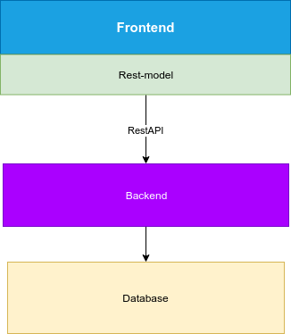
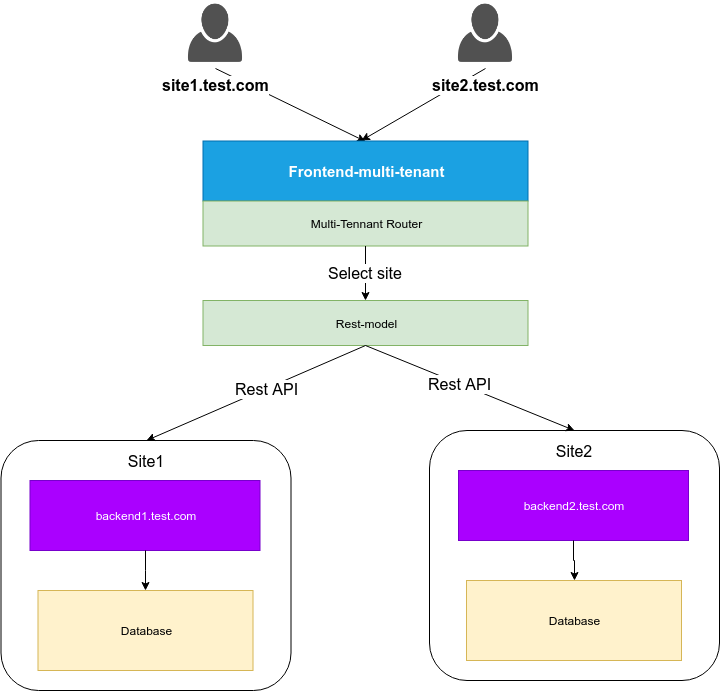

# django-microservices demo
Django Microservices testbed for some use cases:
* Single tenant: Frontend connects to single backend
* Multi-tenant: Multi-sites use 1 Frontend to connects to multiple backends

## Single tenant


### Deploy on Backend
* git clone https://github.com/latuannetnam/django-microservices.git
* cd django-microservices/frontend-single-backend/djbackend
* pip3 install -r requirements.txt
* python3 manage.py makemigrations polls
* python3 manage.py migrate
* python3 manage.py createsuperuser --email admin@example.com --username admin
  * Superuser: admin/xxxx
* cd djbackend
* Edit settings.py
  * ALLOWED_HOSTS = ['backend_ip']
* python3 manage.py runserver 0.0.0.0:8000
* API URL:http://backend_ip:8000
* Admin URL:http://backend_ip:8000/admin

### Deploy on Frontend
* git clone https://github.com/latuannetnam/django-microservices.git
* cd django-microservices/frontend-single-backend/djfrontend
* pip3 install -r requirements.txt
* cd djfrontend
* Edit settings.py
``` python
 ALLOWED_HOSTS = ['frontend_ip']
 DATABASES = {
    'default': {
        'ENGINE': 'django.db.backends.sqlite3',
        'NAME': os.path.join(BASE_DIR, 'db.sqlite3'),
    },
    'api': {
        'ENGINE': 'rest_models.backend',
        'NAME': 'http://backend_ip:8000/',
        # 'USER': 'admin',
        # 'PASSWORD': 'xxxx',
        # 'AUTH': 'rest_models.backend.auth.BasicAuth',
    },
}
```
* cd ..
* python3 manage.py migrate
* python3 manage.py createsuperuser --email admin@example.com --username admin
  * Superuser: admin/xxxx
* python3 manage.py runserver 0.0.0.0:8000
* Admin URL:http://frontend_ip:8000/admin

## Multi-tenants


### Setup host
* /etc/hosts
``` bash
127.0.0.1 site1.test.com 
127.0.0.1 site2.test.com
127.0.0.1 backend1.test.com
127.0.0.1 backend2.test.com
```
### Deploy on Backend
#### Backend1: (backend1.test.com)
* git clone https://github.com/latuannetnam/django-microservices.git
* cd django-microservices/djbackend
* export DB_NAME=site1.sqlite3
* python3 manage.py makemigrations polls
* python3 manage.py migrate
* python3 manage.py createsuperuser --email admin@example.com --username admin
 * Superuser: admin/xxxxx
* python3 manage.py runserver 8000
* API URL:http://backend1.test.com:8000
* Admin URL:http://backend1.test.com:8000/admin
#### Backend2: (backend2.test.com)
* git clone https://github.com/latuannetnam/django-microservices.git
* cd django-microservices/djbackend
* export DB_NAME=site2.sqlite3
* python3 manage.py makemigrations polls
* python3 manage.py migrate
* python3 manage.py createsuperuser --email admin@example.com --username admin
 * Superuser: admin/xxxxx
* python3 manage.py runserver 8001
* API URL:http://backend2.test.com:8001
* Admin URL:http://backend2.test.com:8001/admin

### Deploy on Frontend
* git clone https://github.com/latuannetnam/django-microservices.git
* cd django-microservices/djfrontend-multitenant
* python3 manage.py makemigrations polls
* python3 manage.py migrate
* python3 manage.py createsuperuser --email admin@example.com --username admin
 * Superuser: admin/xxxxx
* python3 manage.py runserver 9000
* Admin URL:http://site1.test.com:9000/admin
* Admin URL:http://site2.test.com:9000/admin


